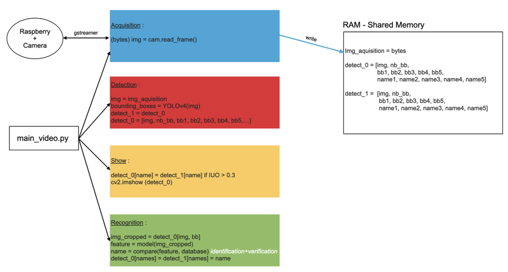
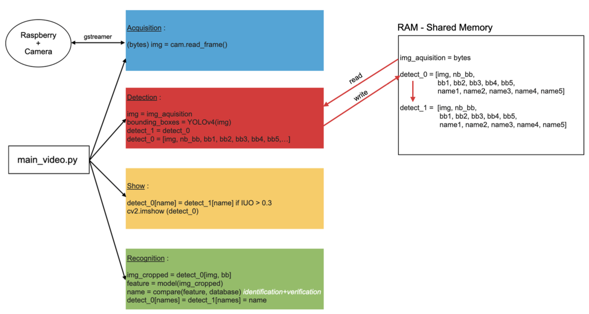
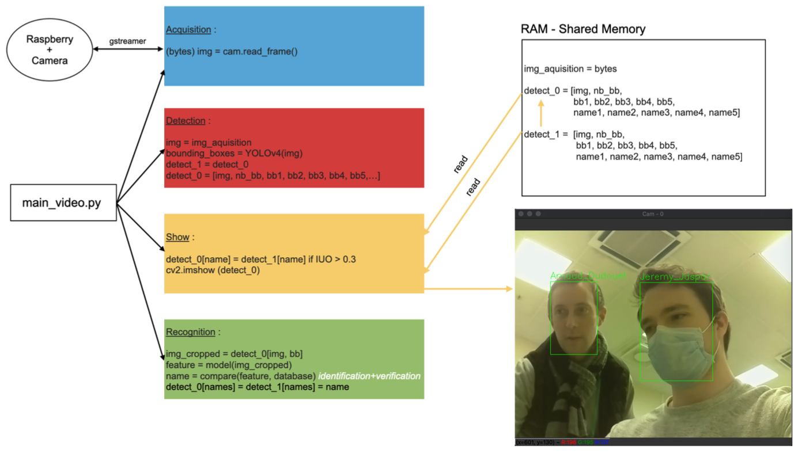
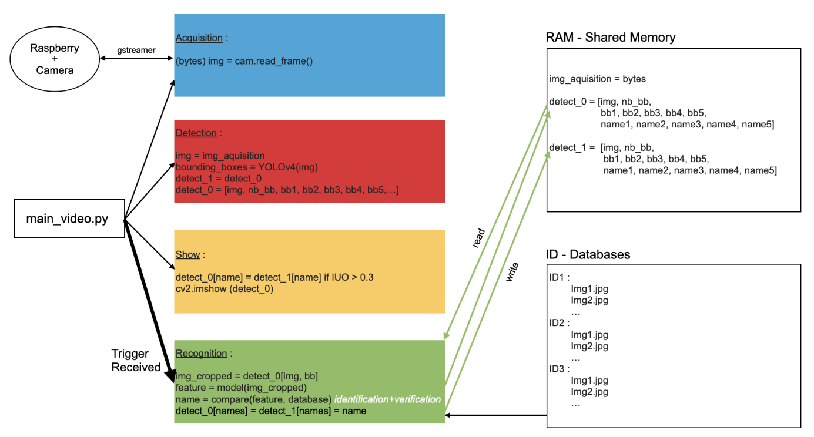

# Internship Project: Multimodal Artificial Intelligence for In-Vehicle Activity Detection

At Stellantis (formerly PSA Group)
🔒 Full research materials are available upon request. Contact me at jeremyjaspar2@gmail.com or on LinkedIn.

This project aims to design and implement a smart in-vehicle activity detection system using multimodal deep learning, combining facial recognition and speaker identification to enhance user interaction and personalization.

---

## 🚀 Getting Started: Smart System for Activity Detection (SSAD)

Follow these steps to register a user and launch the detection system.

🔹 Step 1 – Face Registration (FaceSignIn)
Capture and register multiple images of a user's face:
`python FaceSignIn.py`

🔹 Step 2 – Voice Registration (VoiceSignIn)
Record and register multiple samples of the user's voice:
`python VoiceSignIn.py`

🔹 Step 3 – Launch SSAD System
Start the full multimodal detection system:
`python main.py`

---

## 📷 Facial Recognition Workflow : 

The system is composed of multiple modules dedicated to data acquisition, detection, display, and recognition.

### 1.Acquisition Process : 

  

### 2. Detection Process

  

### 3. Display Process 

  

### 4. Recognition Process 

  

---

## 📌 Project Context

This project was developed as part of a Master's internship at Stellantis, with the objective of integrating AI-driven user recognition features in a vehicle environment to support next-generation intelligent cockpit systems.